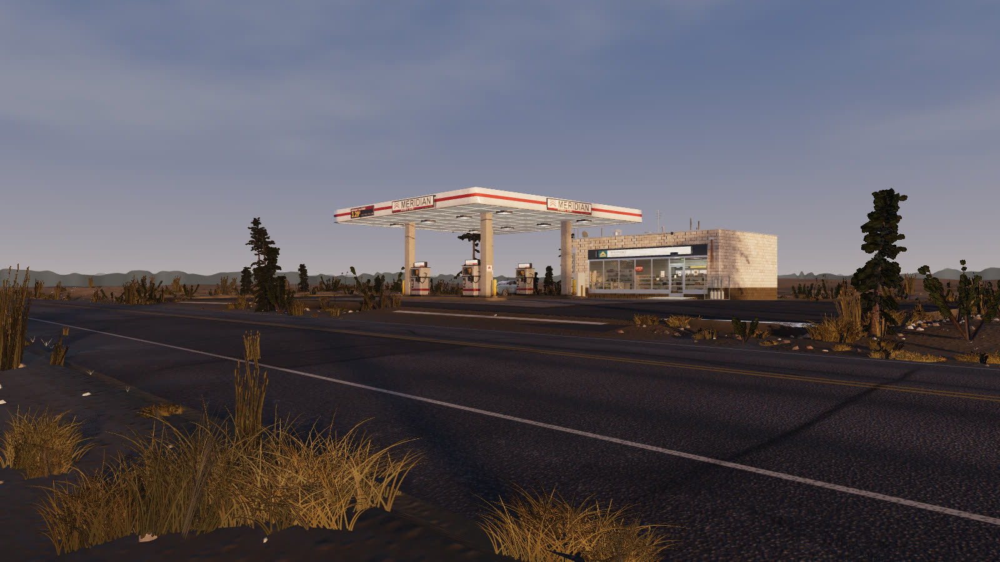

# Dawn Station

A photorealistic first-person gas station at dawn, built in Three.js with zero
external art assets. Every mesh, every texture and every sound in the scene is
generated procedurally in code. There are no image files, no models, no audio
recordings and no material libraries: the asphalt, the canopy steel, the pump
housings, the storefront glazing, the dry grass in the verge, the pines on the
ridge and the whole soundscape are computed at load time.



*A spawn frame straight out of the running build. Nothing in it is composited,
and nothing in it was loaded from a file.*

**Walk it: https://starknightt.github.io/gas-station-highway/**

**Read the brief it was built from: [PROMPT.md](PROMPT.md)** — one page, unedited,
with the places the finished build departs from it listed underneath. **How it was
actually built, and what that cost: [BUILD.md](BUILD.md).**

Read the first-load note below before you open that link — the very first load
in a given browser takes about **216 seconds**, and almost all of it is your
graphics driver compiling shaders. Every load after it takes about twenty.

It wants a desktop GPU. There is no reduced-quality mobile version, but there
are three quality tiers and the scene picks one from the hardware it finds.

## Running it locally

```
pnpm install     # first time only
pnpm play
```

That builds the scene and opens it in your browser.

**Use `pnpm play`, not `pnpm dev`.** They render the same scene, but `dev` serves
several hundred unbundled modules and takes around four minutes to reach a first
frame *every time*. `dev` is for editing the code, not for looking at the result.

### The first load is slow. You pay it once.

|  |  |
| --- | --- |
| **the very first load, once per browser profile** | **216 s**, and it may crash the tab; reload if it does |
| every load after that, including after quitting and reopening | **20 s** |

That is an 11x gap, measured against the same browser profile directory rather
than inferred, and **about 92% of the cold load is the graphics driver compiling
this scene's shader programs** — not the terrain, not the textures and not the
audio. Generation is the small half. The compiled programs are cached on disk
against your browser profile, which is why the second load is fast and why it
stays fast after you quit and reopen.

So open the scene once and let it finish, before you start recording. Then
reload and record. You will not meet the long wait again.

### The tab will look frozen, and that is not a bug

During the wait the page is genuinely unresponsive — the world is built in one
unbroken stretch of work on the same thread that draws the page, so the loading
text cannot even animate. Windows or your browser may offer to kill the page.
**Don't** — wait it out on the first load. Nothing is being downloaded; the
terrain, every material and every prop are being computed.

## Controls

| Input | Action |
|---|---|
| Click | Lock the pointer |
| Mouse | Look |
| W A S D | Move |
| Shift | Sprint |
| Space | Jump |
| E | Use whatever you are stood in front of |
| Esc | Give the mouse back |

A small dot sits in the centre of the screen. It is dim by default and
**brightens and grows slightly when whatever you are pointing at is close enough
to use** — that is the whole of the interface. There are no prompts, no labels
and no outlines on objects, so the dot going bright is the only thing that tells
you `E` will land.

Reach is **2.2 m**. If `E` does nothing, the dot was dim: step closer, or aim a
little more squarely at the thing.

## The three things you can do

Walk up to each one until the dot brightens, then press `E`.

- **A pump.** Lifts the nozzle and starts fuelling; the gallons and the dollars
  tick up on the dispenser's own display. `E` again hangs it up.
- **The shop door.** Rings the bell and swings the leaf.
- **The drinks cooler** at the back of the shop. Open a fridge door, then take
  the bottle off the shelf inside it.

## Quality tiers

Three tiers — `low`, `medium`, `high` — chosen at boot from what the host
reports, and the reasons for the choice are recorded rather than left implicit,
because a tier chosen silently is indistinguishable from a tier chosen wrongly.
A software rasteriser forces `low` regardless of anything else it finds.

The tiers scale the shader program count as well as the triangle count. That
ordering is deliberate: with 92% of a cold load going into compilation, a tier
that cuts geometry and leaves the programs alone misses the thing that actually
hurts. `?tier=low`, `?tier=medium` or `?tier=high` forces one, which is how each
of them gets tested.

## What is in it

- 81 TypeScript files in `src/`, generating the entire scene at runtime.
- **Two network requests per load**: the HTML and one JavaScript bundle.
  Three.js is bundled into it, so there is no CDN fetch and no importmap.
- No asset loading path of any kind. There is no `TextureLoader`, `GLTFLoader`,
  `RGBELoader`, `AudioLoader`, `CubeTextureLoader`, `fetch`, `XMLHttpRequest`,
  `new Image` or `createImageBitmap` anywhere in `src/`.
- Audio synthesised as pure functions — `Float32Array` in, `Float32Array` out —
  with the Web Audio API confined to one file, which is what lets the same code
  render the soundscape to WAV offline for measurement.

## Recording it

`pnpm play` and capture the browser window. Two things worth knowing before you
press record:

- **Load it once, all the way, before you record.** Take the slow load before
  the camera is rolling, then reload and record that.
- **Capture software wants the same GPU the scene does.** Start the capture,
  then reload the scene, then walk — rather than loading first and starting the
  capture while the frame budget is already committed.

There is a reference recording at `shots/film/dawn-station.mp4` — 18 seconds,
1600x900, showing the pump, the door and the cooler. It is what the scene looks
like when everything goes right, and it is for comparison rather than a
deliverable.

## If it does not start

- **`pnpm play` fails during the build.** Someone has left the tree with a
  compile error. `npx tsc --noEmit` names the file.
- **The page is black and stays black.** Open the browser console and look for
  `__SYSTEM_ERRORS`. Systems here fail loudly on purpose rather than degrading
  quietly, so a missing service is reported rather than silently skipped.
- **It runs but everything is grey and slow.** The browser has fallen back to
  software rendering. In Chrome, `chrome://gpu` says whether WebGL is hardware
  accelerated.

## For anyone working on the code

`NOTES.md` is the important file: roughly forty ways this scene has silently
looked correct while being wrong, each with the measurement that caught it. Read
it before trusting a screenshot. `RESUME-PLAN.md` is the live per-system state
and what each owner is on, and `PERF.md` carries the cost measurements including
the cold-load breakdown quoted above.

Verification harnesses live in `tools/`. Each one boots the real scene on a real
GPU and asserts on numbers rather than on how the picture looks:

| | |
| --- | --- |
| `node tools/walkprobe.mjs` | the first-person walk: spawn orientation, collision, the doorway, reach and trigger on all three interactions, and the storefront glazing at grazing angles |
| `node tools/filmwalk.mjs --no-capture` | drives a scripted route through all three interactions at the real walking speed and asserts each one actually happened, in about a minute |
| `node tools/filmwalk.mjs` | the same route, captured and encoded to `shots/film/dawn-station.mp4` |
| `node tools/coldload.mjs` | how long the scene takes to become walkable, on a brand new browser profile against a warm one — the cold/warm gap above |
| `node tools/shaderlint.mjs` | the injected shader chunks, and that the tiers still share the programs they are meant to share. CPU only |
| `node tools/cardclear.mjs` | whether the GPU is actually free before a measurement, with a negative control so it cannot report a clear card by failing to look |

They require a hardware GPU and fail rather than fall back to software, except
where noted.

## Stack

Three.js 0.185 · TypeScript · Vite · Playwright for capture · ffmpeg for encode.

## Licence

MIT
